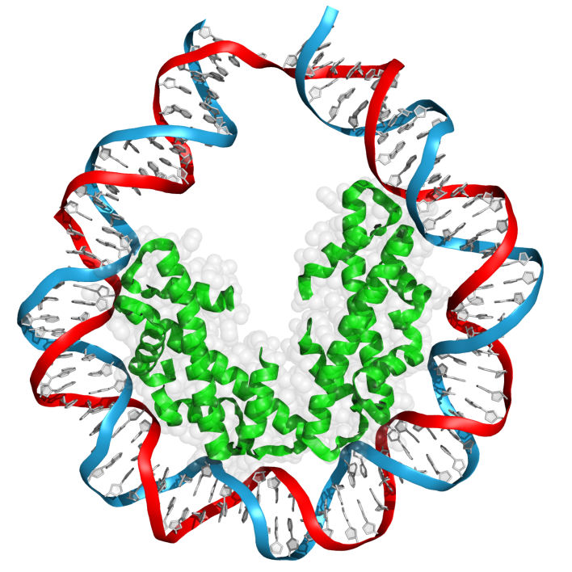

# DNA_Mechanics

DNA mechanics projects at KSU: GROMACS setup/simulation, PyMOL structure prep and visualization, and analysis/plotting of trajectories (twist, h-bonds, base stacking interactions).

## Layout

1. [gromacs_files](gromacs_files): shell scripts for running the MD pipeline (pdb2gmx through trajectory correction) plus the [mdp input files](gromacs_files/inputs) used for each step.
2. [pymol](pymol): structure visualization and manipulation scripts, including the standard DNA/protein visualizer used in the twist-bend manuscript.
3. [do_x3dna](do_x3dna): notes/commands for extracting base pair step parameters from trajectories using do_x3dna.
4. [code](code): analysis and plotting.
   - [twist_analysis](code/twist_analysis): pipeline for extracting and block-averaging twist angles from do_x3dna output.
   - [stacking_hbond](code/stacking_hbond): scripts for building Watson-Crick h-bond index groups and analyzing stacking/h-bond interactions.
   - [plotters](code/plotters): plotting scripts for twist, h-bonds, stacking, and free energy of circularization, plus shared figure styling (fig_style.py).
   - [intact_bps_h_analysis.py](code/intact_bps_h_analysis.py) and [merge_gro_files.py](code/merge_gro_files.py): standalone analysis/utility scripts.

## General workflow

1. Build and run the system using the scripts in `gromacs_files` (see that folder's [README.md](gromacs_files/README.md)).
2. Extract structural parameters from the trajectory with `do_x3dna`, [command found here](do_x3dna/twist_analysis.txt). The important outputted .xvg file will be "Twist_".
3. Analyze and plot using the scripts in `code` (twist_analysis, stacking_hbond, plotters as needed).
    * For twist, use the Twist_*.xvg file as an input in the [process twist script](code/twist_analysis/process_twist.py).
    * For stacking/hbond analysis, follow the instructions found in the local [README](code/stacking_hbond/README.md).
5. Visualize structures/trajectories in PyMOL using the scripts in `pymol`.

Each subfolder has its own README with more specific usage notes.
